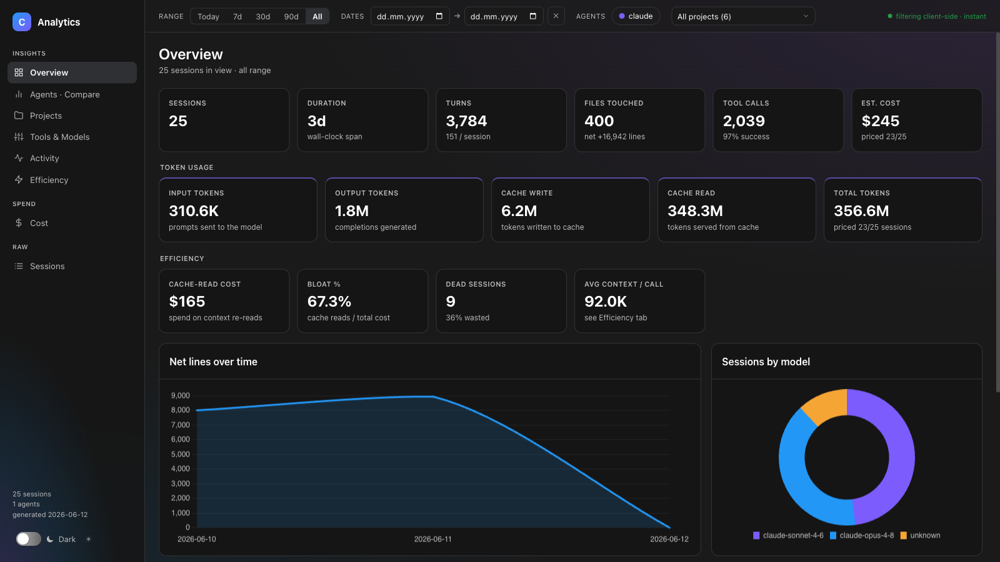
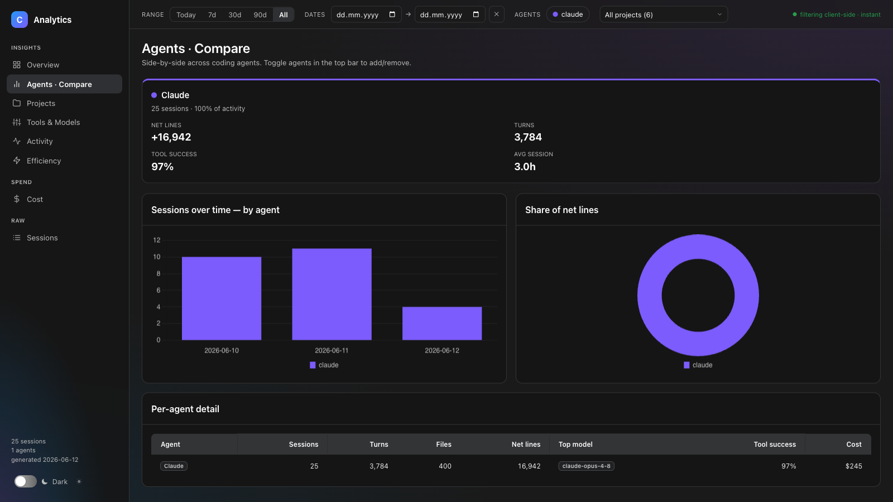
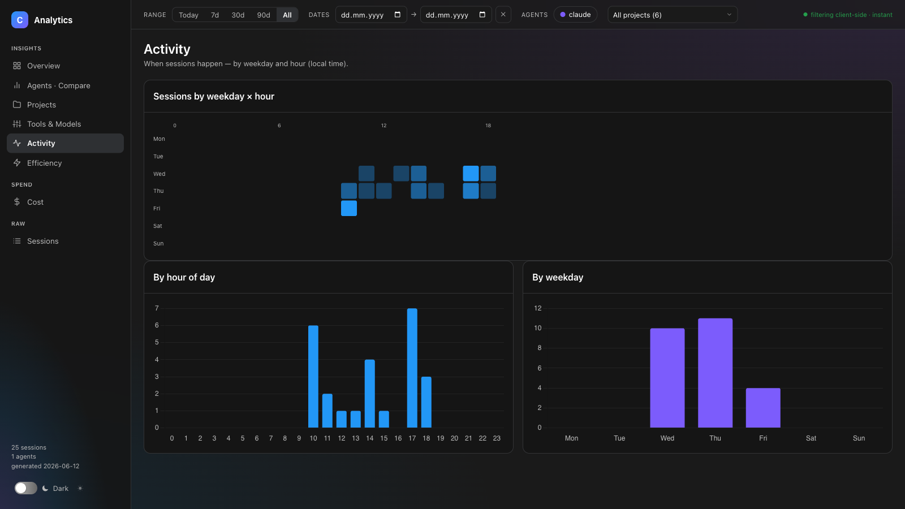
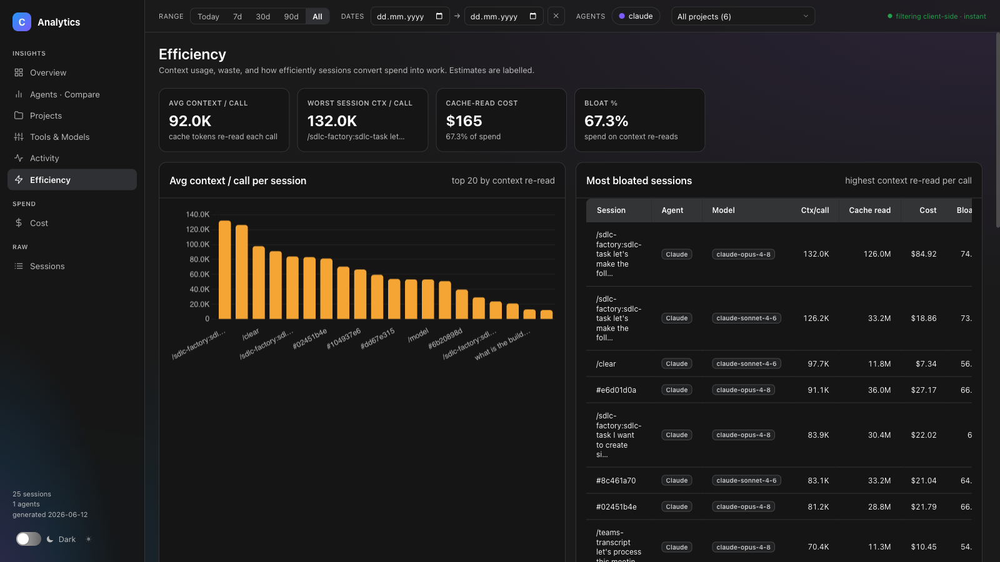
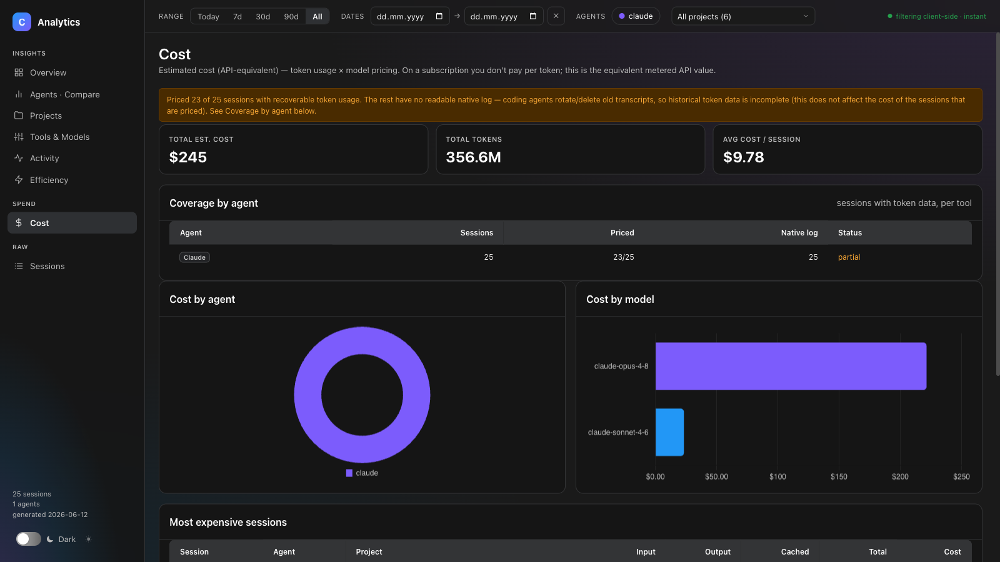
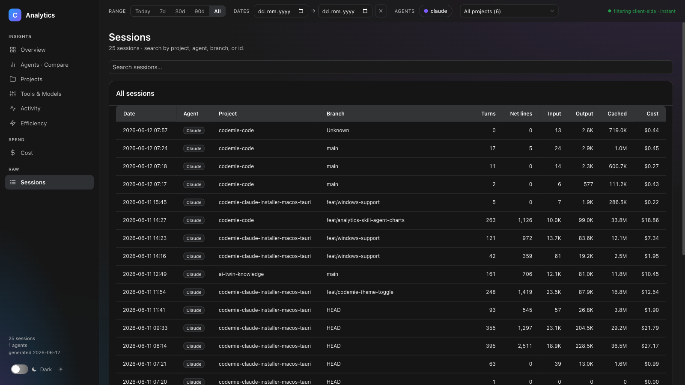
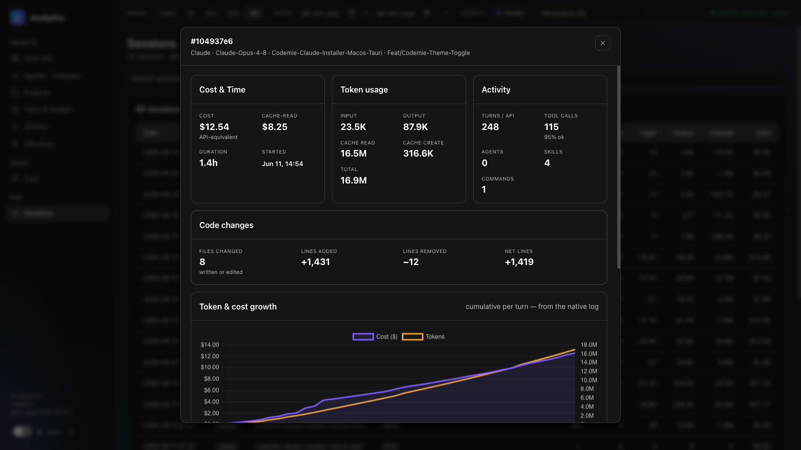

# Analytics Report

The `codemie analytics --report` command generates a **self-contained HTML dashboard** from your local AI session history. No server required — open the file in any browser and explore your data offline.

---

## Quick Start

```bash
# Generate report covering all tracked history and open it immediately
codemie analytics --report --open

# Last 7 days
codemie analytics --report --open --last 7d

# Specific date range
codemie analytics --report --open --from 2025-01-01 --to 2025-01-31

# Filter to one project
codemie analytics --report --open --project codemie-code

# Save to a specific path
codemie analytics --report --report-output ~/reports/weekly.html

# Also export the underlying data as JSON
codemie analytics --report --report-format both
```

---

## What the Report Covers

The dashboard reads every AI session CodeMie has tracked — Claude Code, Gemini, Codex, OpenCode, and the built-in agent — plus native agent logs it discovers automatically. It builds a single portable HTML file with **eight interactive views**.

---

## Views

### Overview



The landing view. Gives every headline number at a glance:

- **Sessions** — total count with wall-clock duration and turns per session
- **Files & lines** — file operations, lines added/removed, net change
- **Tool calls** — total calls and overall success rate
- **Estimated cost** — API-equivalent spend across priced sessions

Below the headline KPIs, two supplementary sections appear:

**Token usage** breaks down input tokens, output tokens, cache writes (tokens written to the prompt cache), and cache reads (tokens served back from cache), plus a combined total.

**Efficiency summary** shows cache-read cost, bloat percentage (cache reads as a share of total spend), dead session count, and average context per call — all linking to the Efficiency tab for full detail.

Charts: net lines over time (line chart by day) and sessions by model (doughnut). A **Top projects** table rounds out the view with per-project file and line counts, each clickable to open a project drill-down modal.

---

### Agents · Compare



Side-by-side comparison across every AI agent that has sessions in the data. For each agent: session count and share of total activity, net lines, turns, tool success rate, and average session duration.

Charts: stacked sessions-per-day by agent, and a doughnut of net lines by agent. A summary table covers sessions, turns, files, net lines, top model, tool success rate, and cost per agent.

Toggle individual agents on or off with the agent pills in the top filter bar to isolate the agents you care about.

---

### Projects

Expandable table of every project. Click a row to reveal its branches; click the project name to open the project modal with a full session list. Columns: sessions, turns, files changed, lines added/removed, net lines, tool success rate, cost.

---

### Tools & Models

Per-tool usage breakdown: call count and success rate rendered as horizontal progress bars (green ≥ 90%, amber ≥ 70%, red below). Token volume by model shown as a horizontal bar chart.

Three additional invocation charts show the top **skills invoked**, **agent subtypes**, and **slash commands** used — ranked by call count across all sessions in view.

---

### Activity



Heat map of sessions by weekday × hour of day (local time). Instantly shows when people are actually working with AI. Supported by two bar charts: sessions by hour of day and sessions by weekday.

---

### Efficiency



Focuses on context waste and productivity. Key metrics:

- **Average context / call** — how many cache tokens are re-read on each turn (a proxy for prompt bloat)
- **Bloat %** — cache-read cost as a fraction of total spend
- **Dead sessions** — sessions that consumed real cost but produced zero file changes and zero net lines (pure inference waste)
- **Session depth** — histogram of turns per session to surface sessions that were never compacted or restarted
- **Command effectiveness** — estimated cost per file changed, broken down by dominant slash command
- **Code changes summary** — files written vs. edited, lines added/removed/net

A ranked table of the most bloated sessions and the dead-session list are both clickable to open the session detail modal.

---

### Cost



Estimated API-equivalent spend (token usage × model pricing). If you use Claude on a subscription, you don't pay per token — this view shows the equivalent metered-API value for benchmarking against alternatives or tracking consumption trends.

Key elements:

- **Coverage banner** — tells you how many sessions were successfully priced and which agents have full, partial, or missing token data
- **Coverage by agent table** — per-agent breakdown of total sessions, priced sessions, sessions with a native log, and coverage status
- **Cost by agent** — doughnut chart
- **Cost by model** — horizontal bar chart of USD spend per model
- **Most expensive sessions** — top 10 ranked by cost, with per-session token breakdown (input, output, cached)

---

### Sessions



Full paginated table of every session (up to 300 shown; searchable). Columns: date, agent, project, branch, turns, net lines, input/output/cached tokens, cost.

Click any row to open the **session detail modal**.

---

## Session Detail Modal



Clicking a session anywhere in the report opens a detail overlay with:

- **Cost & Time** — API-equivalent cost, cache-read cost, duration, start time
- **Token usage** — input, output, cache read, cache create, total
- **Activity** — turns, tool calls and success rate, agent/skill/command invocation counts
- **Code changes** — files changed, lines added/removed, net
- **Token & cost growth chart** — cumulative cost and token usage per turn (from the native log; shown when data is available)
- **Dispatch timeline** — Interactive Gantt of agent dispatches. Bars are proportionally scaled to the agent activity window; click any bar to open a detail panel on the right showing that agent's estimated cost, token breakdown (input / output / cache read / cache write), wall-clock duration, start offset from session start, and top tool call counts. Skills and slash commands are shown in the chip lists below the Gantt, not as bars.
- **Skills / Agent subtypes / Slash commands** — chip lists of what was invoked and how many times

---

## Filters

All filtering happens client-side — no server, instant response.

| Filter | Where | How |
|---|---|---|
| Time range | Top bar | Preset buttons: Today, 7d, 30d, 90d, All; or enter custom From/To dates |
| Agent | Top bar | Toggle agent pills on/off |
| Project | Top bar | Dropdown of all projects in the data |

Filters apply to every view simultaneously. The URL does not update, so share the HTML file directly — recipients can apply their own filters.

---

## Output Formats

| Format | Flag | Output |
|---|---|---|
| HTML dashboard | `--report` or `--report-format html` | Self-contained `.html` with all charts and data embedded |
| JSON data | `--report-format json` | The cost-enriched session payload — useful for further analysis in notebooks or BI tools |
| Both | `--report-format both` | Writes `.html` and `.json` with a shared base name |

Default output path: `./codemie-analytics-YYYY-MM-DD.html` in the current directory. Override with `--report-output <path>`.

---

## Data Sources

CodeMie merges two sources to give the most complete picture:

1. **Tracked sessions** — metrics written by the CodeMie hooks during your sessions
2. **Native agent logs** — transcripts left by `claude`, `gemini`, and other agents that ran outside of CodeMie (discovered automatically; deduped against tracked sessions)

Pass `--no-scan-native` to disable native-log discovery and use only CodeMie-tracked sessions.

Cost enrichment requires the native log to read per-turn token data. Sessions where the log has already been rotated or deleted will appear with `—` cost; the **Coverage** section in the Cost view shows exactly which sessions are priced.

---

## CLI Reference

```
codemie analytics [options]

Report flags:
  --report                  Generate a self-contained HTML dashboard
  --open                    Open the report in the default browser after generation
  --report-output <path>    Output path (default: ./codemie-analytics-YYYY-MM-DD.html)
  --report-format <fmt>     html | json | both (default: html)

Filter flags:
  --last <duration>         Last N days/hours/minutes: 7d, 24h, 30m
  --from <YYYY-MM-DD>       Start date (inclusive)
  --to   <YYYY-MM-DD>       End date (inclusive)
  --project <pattern>       Filter by project name (basename, partial, or full path)
  --agent <name>            Filter by agent: claude, gemini, codex, etc.
  --branch <name>           Filter by git branch
  --session <id>            Filter to a single session

Other flags:
  -v, --verbose             Session-level breakdown in the terminal output
  --export <fmt>            Export terminal data to json or csv file
  -o, --output <path>       Output path for --export
  --no-scan-native          Skip native-log discovery
```

All filter flags work for both the terminal output and the HTML report. The date filters control which sessions are **embedded** in the report; the client-side range presets (Today / 7d / 30d / 90d) then let the report viewer narrow further within that data.
